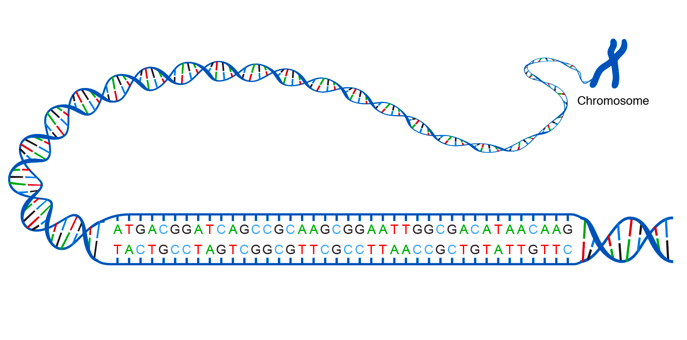

# DNA

## Code + Data as DNA

Because both the algorithm and the data can be stored an accessed in a uniform way, we can treat each attribute as a [base](https://en.wikipedia.org/wiki/DNA_sequencing) that makes up a greater DNA seqeunce. The DNA sequence determines the behavior.

By expressing everything in a standardized format (JSON), it becomes easy to synthesize various base features to accomplish interesting goals, while maintaining a high level cohesive structure.

1. **Designed to be remixed:** Everything in Pinokio is JSON, which means you can store code as data, and data as code. Basically, Pinokio is not "an engine that lets you use AI", but an AI itself, complete with its own native memory.
    - **Code (JSON-RPC):** Every Pinokoio API method follows the same protocol (they must have the same top level function signature), and this standardized input/output interface makes it easy to switch out one module to another.
    - **Data:** JSON
2. **Self organization:** The Pinokio system automatically merges all the JSON modules in realtime. You can create emergent behaviors simply by dropping certain JSON structures in the App/API repository.

