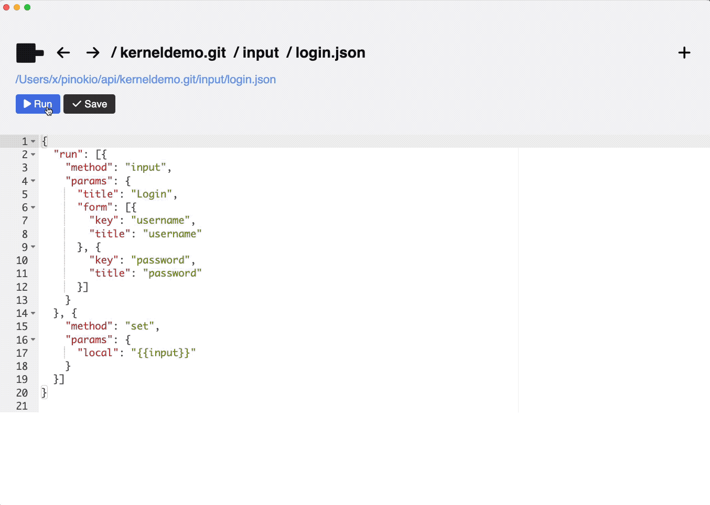
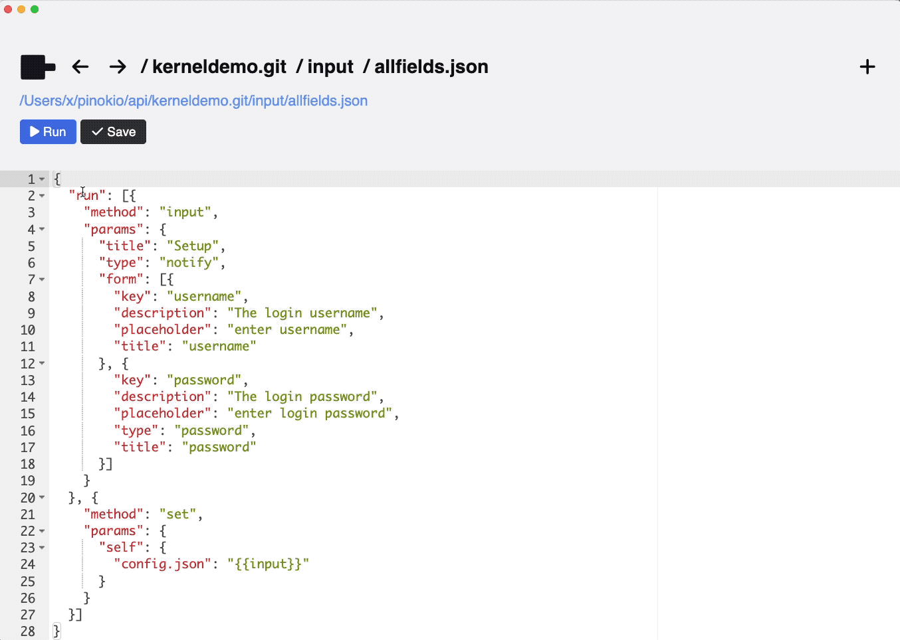
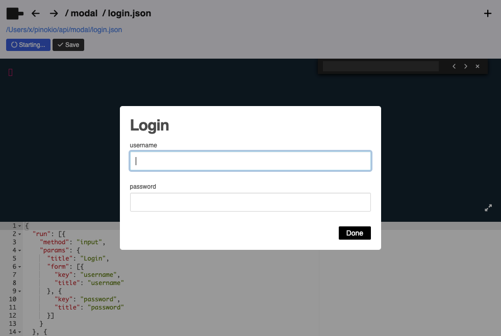

# Input

You can accept user input through the `input` API.

It can be used to receive custom human input and returns a key-value pairs object.

## Types

There are two types: "modal" and "notify". They have the same functions but just displayed differently.

### Modal



<br>

### Notify



## input

```json
{
  "method": "input",
  "params": {
    "title": <The title of the input modal>,
    "description": <The description of the input modal>,
    "type": <input dialog type ("modal" or "notify")>,
    "form": [{
      "type": <input field type, for example 'text', 'password', etc. (optional)>,
      "key": <Input field 1 key (required)>,
      "title": <Input field 1 title>,
      "description": <Input field 1 description>,
      "placeholder": <Input field 1 placehoder>,
      "default": <the default value for field 1>
    }, {
      "type": <input field type, for example 'text', 'password', etc. (optional)>,
      "key": <Input field 2 key (required)>,
      "title": <Input field 2 title>,
      "description": <Input field 2 description>,
      "placeholder": <Input field 2 placehoder>,
      "default": <the default value for field 1>
    }, {
      ...
    }]
  }
}
```

### params

The `input` API lets you insert an interactive modal in the workflow.


- **title:** The input modal title
- **description:** The input modal description
- **type:** (optional) "notify"|"modal" (default)
  - the "notify" type opens the input dialog using the "notify" API
  - the "modal" type opens a modal dialog
- **form:** The form array. Can include as many keys as you want.
  - **key:** (required) The field key
  - **title:** (optional) The field title (displayed above the input field)
  - **description:** (optional) The field description (displayed above the input field along with the title)
  - **default:** (optional) The default value for the field. If specified, the input field will be pre-filled with this value.
  - **placeholder:** (optional) The placeholder text for the field.
  - **type**: (optional) The input field type, for example 'text', 'password', etc.


### return value

Once the user clicks the "done" button to close the dialog, The `input` API will return the key-value pairs constructed from the `form`.

Here's an example where you can accept a username and a password:

```json
{
  "run": [{
    "method": "input",
    "params": {
      "title": "Login",
      "form": [{
        "key": "username",
        "title": "username"
      }, {
        "key": "password",
        "title": "password",
      }]
    }
  }, {
    "method": "net",
    "params": {
      "url": "https://mywebsite.com",
      "method": "post",
      "data": {
        "username": "{{input.username}}",
        "password": "{{input.password}}"
      }
    }
  }]
}
```

First, we use the **input** API to display a modal with a form to construct an object with the keys: `username` and `password`:



When the user enters the username and the password and presses "done", the `input` API will return the following value:

```json
{
  "input": {
    "username": "cocktailpeanut",
    "password": "7gproteinperserving"
  }
}
```

This then can be used in the second API call (`net`) to make a network API request.
