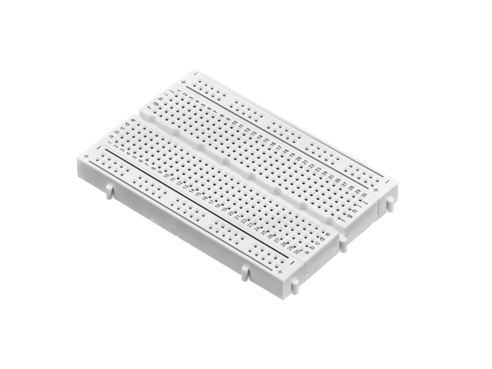

# API

This section will cover all the core RPC APIs supported by Pinokio.

- [File System](fs): read from and write to the file system
  - [fs.write](fs#fs-write): write to the file system
  - [fs.download](fs#fs-download): download a remote file to the local file system
- [Data Structure](datastructure): manipulate data
  - [local](datastructure#local): manipulating local variables 
  - [global](datastructure#global): manipulating global variables
  - [self](datastructure#self): manpipulating the running script itself at runtime
- [Shell](shell): Programmatically run shell commands
- [Flow Control](flow): control how the code is run
  - [goto](flow#goto): jump to certain location in the script
  - [process.wait](flow#process-wait): pause execution (either indefinitely, or for a duration)
- [Notification](notify): Display notifications
- [Input](input): Display notifications
- [Browser](browser): Automatically open or close browser windows
- [Logging](log): Logging data during executiong (for debugging, etc.)
