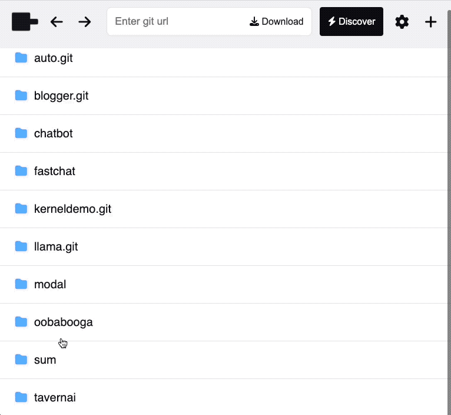
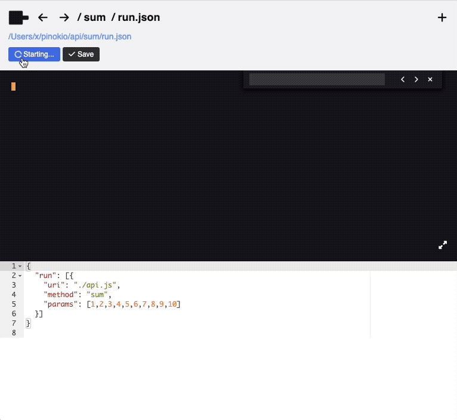
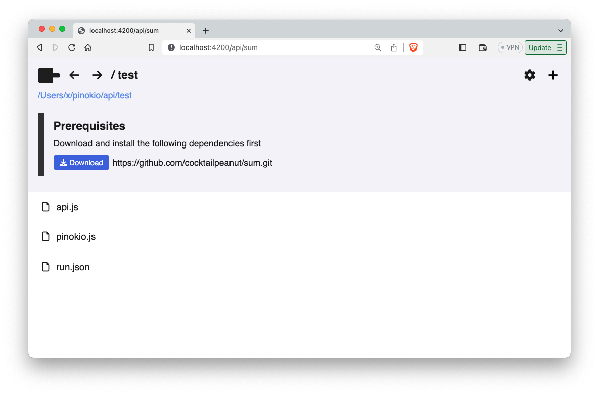

# Quickstart

Let's try writing a custom API.

This example will simply take an array of numbers, and return the total.

We will call the API "sum"



## 1. Create a project

We need to first create a project. Create a folder under `~/pinokio/api`:

```
cd ~/pinokio/api
mkdir sum
```

## 2. Create a Pinokio script

Let's first create a script file.

Create a file named `run.json` under the `~/pinokio/api/sum` folder we just created:

```json
{
  "run": [{
    "uri": "./api.js",
    "method": "sum",
    "params": [1,2,3,4,5,6,7,8,9,10]
  }]
}
```


## 3. Create an API file

As we can see from the request object, this request will look for a file named `./api.js`:


```json
{
  "uri": "./api.js",
  "method": "sum",
  "params": [1,2,3,4,5,6,7,8,9,10]
}
```

So let's create a file named `api.js` in the same folder as the request script (`~/pinokio/api/sum`):


```javascript
// api.js
class API {
  async sum (req, ondata, kernel) {
    // add all the items in the req.params array and return the result
    let sum = 0
    for(let item of req.params) {
      sum += item
    }
    return sum
  }
}
module.exports = API
```

## 4. Run in Pinokio

And that's all there is to it!

1. Open Pinokio and you will see the `sum` folder you've just created.
2. Navigate into the folder and click the **run.json** file, and click "Run".
3. You will see that it correctly calculates the sum of all the numbers and returns 55.


The return value of the API is printed right below the terminal.

## 5. Displaying progress

In many cases, calling a shell command takes a while to finish and you may want to display the progress of the API call.

To emulate this, let's try to artificially slow down the API execution first, and go from there. We will add a 1 second delay inside the for loop:

```javascript
// api.js
class API {
  async sum (req, ondata, kernel) {
    // add all the items in the req.params array and return the result
    let sum = 0
    for(let item of req.params) {
      sum += item

      // [ADDED] 1 second delay
      await new Promise((resolve, reject) => {
        setTimeout(() => {
          resolve()
        }, 1000)
      })

    }
    return sum
  }
}
module.exports = API
```

Now when you run the `run.json`, you will get the response (55) after 10 seconds.

As we mentioned above, in these cases we may want to display the progress so the users are aware of what's going on.

We can accomplish this with the `ondata()` callback passed in as the second parameter of the `sum()` method:


```javascript
// api.js
class API {
  async sum (req, ondata, kernel) {
    // add all the items in the req.params array and return the result
    let sum = 0
    for(let item of req.params) {
      sum += item

      await new Promise((resolve, reject) => {
        setTimeout(() => {
          resolve()
        }, 1000)
      })

      // [ADDED] Print progress
      ondata({
        raw: sum + "\r\n"
      })

    }
    return sum
  }
}
module.exports = API
```

This will stream the "raw" string to the terminal, and you will see that the current sum for every loop will be printed every 1 second:



## 6. Calling APIs

So far, we have created an API and included a companion script that calls the API.

It's important to remember that both the API and the script are part of the same repository. This is why we could use the realtive path as uri (`./api.js`) when calling the API:

```json
{
  "run": [{
    "uri": "./api.js",
    "method": "sum",
    "params": [1,2,3,4,5,6,7,8,9,10]
  }]
}
```

But in many cases, you may simply want to call an EXISTING API from your script.

To accomplish this, all you need to do is:

1. Install the API (assuming that the API has been published to a public git URI)
2. Call the API using the public git URI intead of realtive path.


```json
{
  "run": [{
    "uri": "https://github.com/cocktailpeanut/sum.git/api.js",
    "method": "sum",
    "params": [1,2,3,4,5,6,7,8,9,10]
  }]
}
```

## 7. Specifying dependencies

When running the script from the last section, we are assuming that the API published at `"https://github.com/cocktailpeanut/sum.git/api.js"` has been downloaded and exists locally.

Basically, to make sure that anyone who downloads your script can run your script, you need to let these people know that they need to have these APIs installed on their machines.

You can achieve this by specifying an attribute named `"dependencies"` in a file named `pinokio.js` in your script folder.

```javascript
module.exports = {
  dependencies: [ "https://github.com/cocktailpeanut/sum.git" ]
}
```

Then browse to the script folder, and you will see that Pinokio now suggests the "Prerequisites" based on the dependencies array.




## 8. Using 3rd party libraries and engines

Often you may want to import 3rd party libraries or carry out some sophisticated tasks before being able to use the API. For example:

1. Build an API using 3rd party NPM packages (such as `next.js`, `nodemailer`, `GraphicsMagick`, etc)
2. Start a server before running the API (such as database systems, servers, etc.)

Fortunately, pinokio has various building blocks to make these things more user friendly.

### Installers

For example, let's say you are building a Pinokio API that uses the `nodemailer` package to send emails. You may want to create an install script named **install.json**:

```json
{
  "run": [{
    "method": "shell.run",
    "params": {
      "message": "npm install nodemailer"
    }
  }]
}
```

Then, to make it more visible to the end users you can:

1. either include it in the README.md as a link
2. or add a menu bar button with pinokio.js: [learn more](/tutorial/menu)

### Start scripts

Often you may want your API to automatically start a server or a connection when Pinokio starts.

For example if your API involves a database system, you will probably want to make sure that your DB automatically starts up when Pinokio starts, so the endpoint will be available when you make API requests immediately after.

In these cases, you can use the [self driving scripts](/tutorial/autostart) to automatically launch whatever services you need, automatically.
