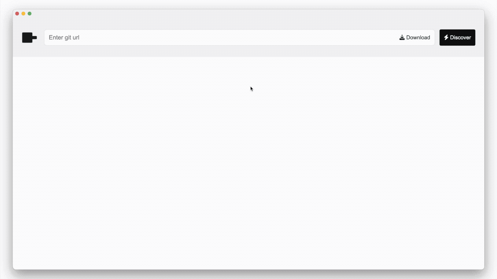
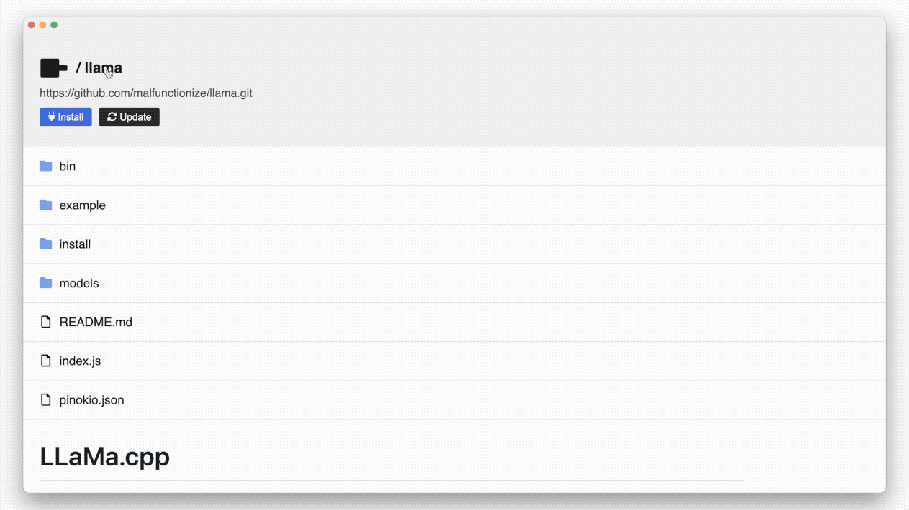
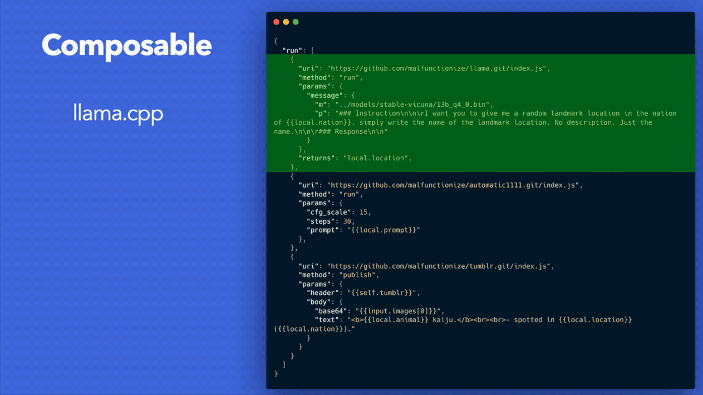
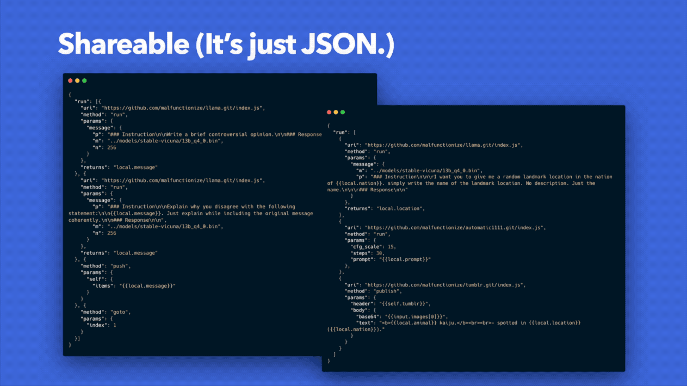

<blockquote class='info'>

<h4>notice</h4>

 

Pinokio is like a web browser. It doesn't do anything on its own, but will become more and more useful as more people write and share apps and API integrations going forward.

 

To stay on top of all the new APIs and app integrations,

- Follow <a href="https://twitter.com/cocktailpeanut">@cocktailpeanut</a> on Twitter
- Join the <a href="https://discord.gg/TQdNwadtE4">Pinokio discord</a>
</blockquote>

# Pinokio

> AI Browser

Pinokio is a browser that lets you **install, run, and automate any AI applications and models** automatically and effortlessly.

No more opening the terminal. No more `git clone`. No more `conda install`. No more `pip install`. No more messing with execution environments.

**All of them automated with one click**, as easy as using a browser.

## Run anything, in a browser.

There are so many applications that require you to open your terminal and enter commands, not to mention deal with all kinds of complicated environment and installation settings.

With Pinokio, all of this can be packaged into a simple JSON script, which can then be run in a browser setting with **just one click.**

### Terminal apps in the browser

Any CLI (command line interface) apps can be ported to run in the Pinokio browser. Some examples:

- **installation scripts:** `pip install`, `npm install`, etc.
- **python scripts:** any python script can be run with one click. No terminal required.
- **any shell command:** `mkdir`, `curl`, `git`, etc.
- **anything:** anything that can run in a terminal can be automated with Pinokio, in the browser.

### Servers in the browser

Running a server on a computer is not a trivial task. You need to open a terminal, and run a bunch of commands to start the server, and keep the terminal open to keep them running.

**Not anymore.**

Pinokio lets you can **launch servers and daemons directly in the app, with one click.**

Now anyone can run powerful server based apps on their own computer, effotlessly:

1. **Database Systems:** Elasticsearch, MongoDB, RocksDB, Vector Databases, etc.
2. **Decentralized Applications:** Bitcoin, IPFS, etc.
3. **AI Servers:** StableDiffusion Web UI, Gradio, Langchain apps, etc.
4. **Web apps:** Any web apps, really, can be run in the Pinokio browser.
5. **Bots:** Spin up bots that run in the background, in the Pinokio browser, with one click.

### Example

Anything a human can do on a computer, can be done automatically thanks to Pinokio. Here's an example:

In this example, Pinokio automatically:

1. creates a node.js project
2. installs libraries
3. writes a server for a web server
4. starts the server
5. opens a browser

All with ZERO human intervention, 100% automated.

## Automate Everything

### There's a script for that

Pinokio is an application that can autonomously read, write, process, and execute anything on your computer, with a simple scripting language. Pinokio can:

- compose files
- download files
- accumulate data
- install libraries and other applications
- run shell commands
- make network requests
- publish files
- browse the internet
- and **pretty much anything a human can do on a computer, without requiring humans.**

### Install and control any AI

With the ultimate automation capabilities, Pinokio can even automatically install and run various AI engines and models on the fly, and then script them to make decisions and execute tasks. Any AI 

- Open source AI
  - Language models: llama.cpp
  - Image models: Stablediffusion
  - Diffusers
  - Transformers
  - etc.
- AI frameworks and APIs
  - OpenAI API
  - Langchain
  - etc.

### Totally autonomous agents

Pinokio is already useful for running "one-click scripts" that autmoate all kinds of things. But we can go further.

Pinokio supports [totally autonomous agents that can run with ZERO human intervention](/tutorial/autostart).

## Feature Highlights

### Browse and Install

Browse and install anything, including AI engines (llama, stablediffusion, etc.) **with one click**.

### Run

Automate anything through script.

### Automate

Mix and match multiple scripts to execute complex tasks.

### Share

Instantly share the workflows, scripts, datasets, and everything over git.

[Everything in Pinokio is a file](fs/overview.html), therefore ultra-shareable.

## How it works

Pinokio is a virtual computer.

It has all the components of a traditional computer, except every component is written from scratch to facilitate the main goal, which is to build the ultimate application that can live.

### Architecture

1. **[File System](fs/overview):** Where and how Pinokio stores files.
2. **[Processor](processor/overview):** How Pinokio runs tasks.
2. **[Memory](memory/overview):** How Pinokio implements a state machine using its built-in native memory.
4. **[API](api/overview):** Core APIs shipped with Pinokio.
4. **[Kernel Programming](custom/what):** Hack the Pinokio kernel to build custom APIs.
5. **[Lifeform](ai/overview):** How to build a fully autonomous application that evolves on its own.

