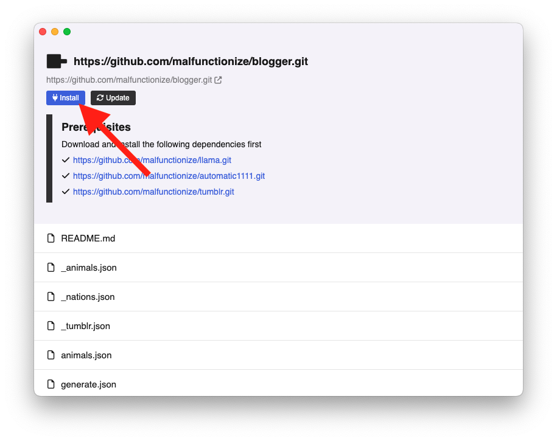

# Declaring dependencies

Often your app may depend on 3rd party APIs. For example imagine an autonomous blogger app, which generates paragraphs and images with AI, and publishes the content to Tumblr.

This app may utilize:

1. **LLaMA API:** for LLM text generation
2. **StableDiffusion API:** for image generation
3. **Tumblr post API:** for posting to Tumblr.com

When publishing your app, you can include the links in your `README.md` file so people can download them one by one.

But this is such a common feature that Pinokio has this built in.

In addition to including the links in the README file, you can use the `dependencies` array in the `pinokio.js` file to declare all the APIs one must install before using your app.

Here's an example `pinokio.js` file:

```javascript
// pinokio.js
module.exports = {
  menu: [{
    html: "<i class='fa-solid fa-plug'></i> Install",
    href: "install.json"
  }],
  start: "start.js",
  dependencies: [
    "https://github.com/malfunctionize/llama.git",
    "https://github.com/malfunctionize/automatic1111.git",
    "https://github.com/malfunctionize/tumblr.git"
  ]
}
```

When this repository is downloaded and loaded on Pinokio, the user will see the following screen:


When you click the download buttons, they will open in a new Pinokio window, where you can download and install these APIs.

Once all the APIs have been downloaded, refresh the page and you will see that the "download" buttons are gone and replaced with check marks to indicate that these dependencies have been downloaded:


Once all the dependencies have been installed, you can install the current app itself.


