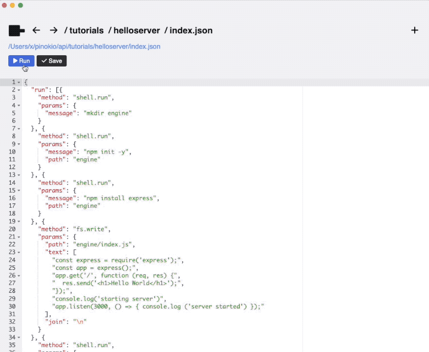

# Run multiple commands

In this tutorial we will write a script that runs multiple commands in sequence.

More specifically, just with one click, our script will:

1. Initialize a new NPM project
2. Install the `express` NPM package (a web server library)
3. Write a JavaScript code for the web server
4. Spin up the express server

100% automatically.



Let's try creating an example.

Create a folder named `helloserver` and create a file named `index.json`:

```
~/pinokio
  /api
    /helloworld
      index.json
    /helloserver
      index.json
  /bin
```

The `index.json` should look like this:

```json
{
  "run": [{
    "method": "shell.run",
    "params": {
      "message": "mkdir engine"
    }
  }, {
    "method": "shell.run",
    "params": {
      "message": "npm init -y",
      "path": "engine"
    }
  }, {
    "method": "shell.run",
    "params": {
      "message": "npm install express",
      "path": "engine"
    }
  }, {
    "method": "fs.write",
    "params": {
      "path": "engine/index.js",
      "text": [
        "const express = require('express');",
        "const app = express();",
        "app.get('/', function (req, res) {",
        "  res.send('<h1>Hello World</h1>');",
        "});",
        "console.log('starting server')",
        "app.listen(3000, () => { console.log ('server started') });"
      ],
      "join": "\n"
    }
  }, {
    "method": "shell.run",
    "params": {
      "message": "node index",
      "path": "engine"
    }
  }]
}
```

1. The first step runs `mkdir helloserver` to create a folder named `helloserver`
2. The second step runs `npm init -y` to initialize an NPM project
3. The third step runs `npm install express` to install the [express.js](https://expressjs.com/) package, which we will use to build a super simple web server.
4. The fourth step uses an API called [fs.write](/api/fs) to write lines to the file named `helloserver/index.js`
5. The final step runs `node index` to start the express server code we just wrote through the `fs.write` API.

At this point your `helloserver` project folder will look something like this:

```
~/pinokio
  /api
    /helloworld
      index.json
    /helloserver
      index.json
      /engine
        package.json
        index.js
        /node_modules
  /bin
```

Now go to `http://localhost:3000` and you will see the web server is up and displaying "Hello World".


