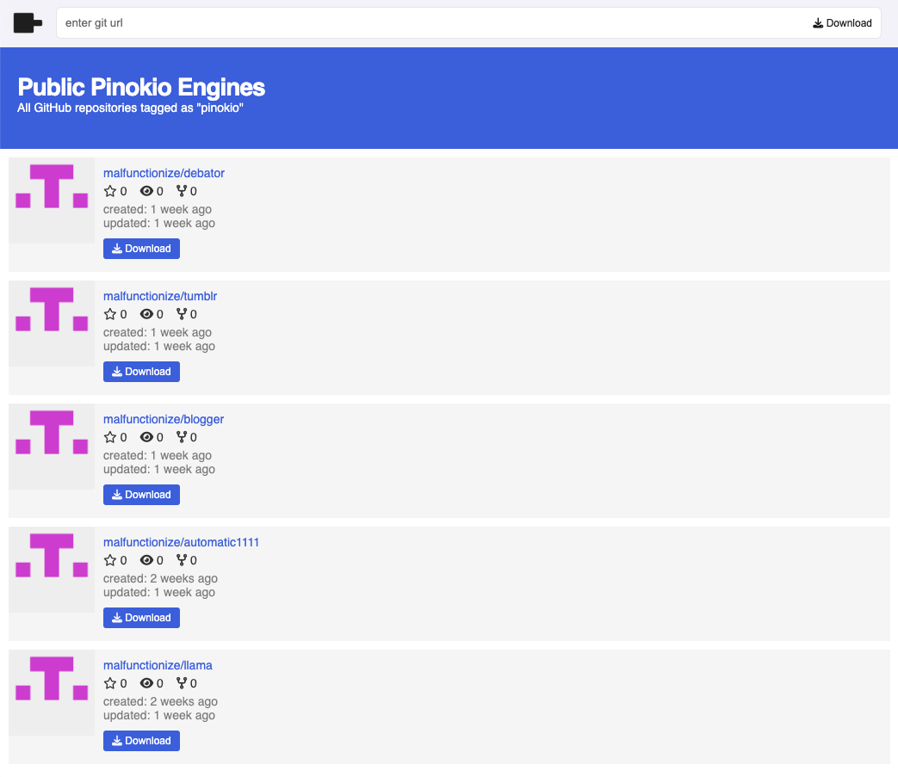

# Publishing Scripts

Scripts are powerful but they are even more powerful when they are shared with the world, since everyone can download and run the same workflow with one click.

There are a couple of things to note:

1. **Include an Example:** Package an example along with the API if possible. It's nice to be able to install an API and immediately try it out. You can set up a separate example repository, or include it in the same API folder.
2. **Publish to GitHub:** Publish to GitHub. You can publish to other git hosting services as well, but GitHub recommended for now [for discoverability](#list-on-pinokio).
3. **List:** When publishing to GitHub, tag your repository with `pinokio`, and it will automatically show up inside the Discover page in the Pinokio app.

## Include a README

Just like how GitHub automatically renders README.md files for any git repository, Pinokio also renders the `README.md` files. All you need to do is include the file in the root folder of your API repository.

a README documentation helps users easily use your API, so be as descriptive as possible.

## Include some examples

Also, it's great to include some example scripts, so the users who download your API can try out the API instantly without them having to write their own script to test.

For example,

1. just create an `example` folder and include the example scripts under the folder
2. link to the example scripts from `README.md`

Or if you want just a simple script, you can just create one `example.json` in the root folder. Choice is up to you.

## Publish to GitHub

Finally we're ready to publish.

There's nothing special here, just publish the repository to GitHub just like you publish any repository.

## List on Pinokio

Pinokio has a "discover" page which displays all the public Pinokio APIs published on GitHub.

To list your published API on the Pinokio discover page, just tag your repository with "pinokio", and it should immediately show up on the discover page:

