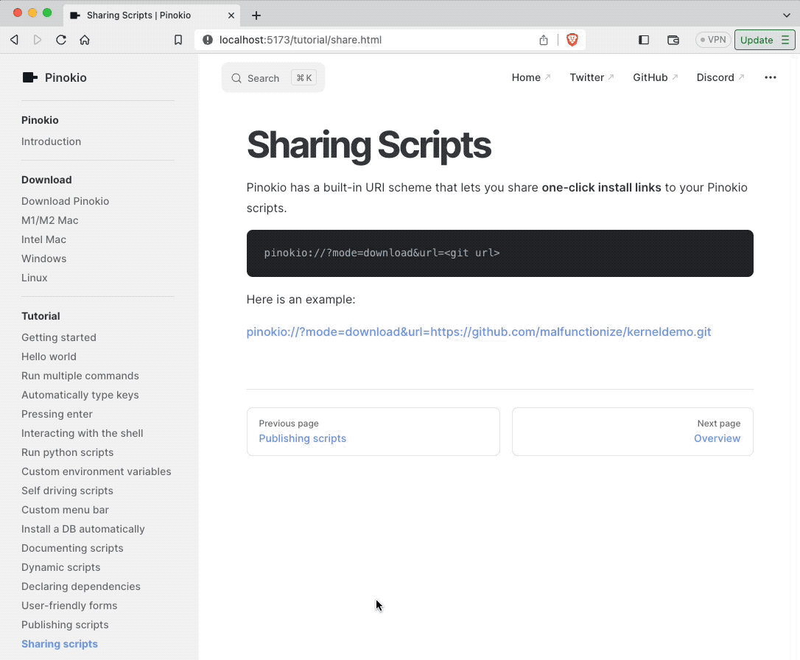

# Sharing Scripts

Pinokio has a built-in URI scheme that lets you share **one-click install links** to your Pinokio scripts.




```
pinokio://?mode=download&url=<git url>
```

Here is an example:

[pinokio://?mode=download&url=https://github.com/malfunctionize/kerneldemo.git](pinokio://?mode=download&url=https://github.com/malfunctionize/kerneldemo.git)

