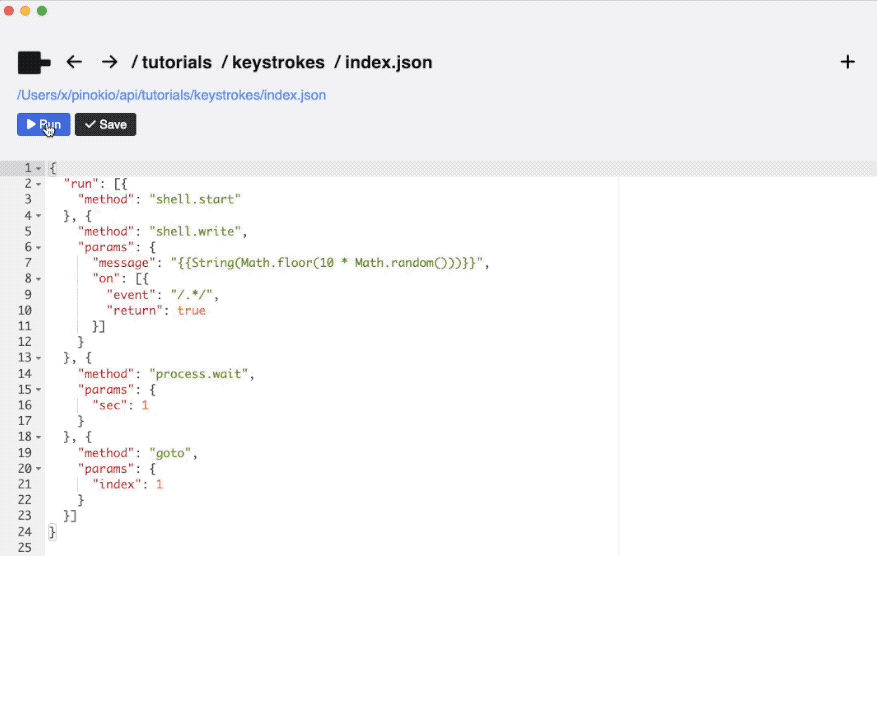

# Enter keystrokes

While you can already achieve a lot of things by simply running one-off commands with `shell.run`, this may not be enough for more advanced cases where you need more fine grained access to the shell.

For example instead of simply running commands, you may neeed to:

1. Enter keystrokes one by one.
2. Keep the shell running instead of just running one command and halt.
3. Monitor and handle events in the shell.
4. Return values from the shell

In this tutorial, we will write a script that automatically enters keystrokes:



We can achieve this by using:

1. `shell.start`: to create a new shell session.
2. `shell.write`: to write to the created shell session.

Let's try entering keystrokes to the shell. This example will simply loop forever and keep entering a random number into the terminal every 1 second.

```json
{
  "run": [{
    "method": "shell.start"
  }, {
    "method": "shell.write",
    "params": {
      "message": "{{String(Math.floor(10 * Math.random()))}}",
      "on": [{
        "event": "/.*/",
        "return": true
      }]
    }
  }, {
    "method": "process.wait",
    "params": {
      "sec": 1
    }
  }, {
    "method": "goto",
    "params": {
      "index": 1
    }
  }]
}
```

Here's how it works:

1. First we start a shell with `shell.start`
2. Then we call `shell.write` to write the `params.message` to the shell. In this case the expression `{{String(Math.floor(10 * Math.random()))}}` means we are randomly generating a number between 0 and 10 and entering the number to the terminal (without pressing enter)
3. The `params.on` is the event handler that waits for the `/.*/` pattern (which matches any character) and returns `true`. This means this command will write the random number to the terminal and immediately return.
4. Then it goes to the next step where it runs `process.wait` with `sec: 1`, which pauses for 1 second.
5. Then it goes on to the next step where it runs "goto 1", which loops back to the `shell.write` instruction at position 1.
6. The script loops forever, printing a random number to the terminal every one second.

